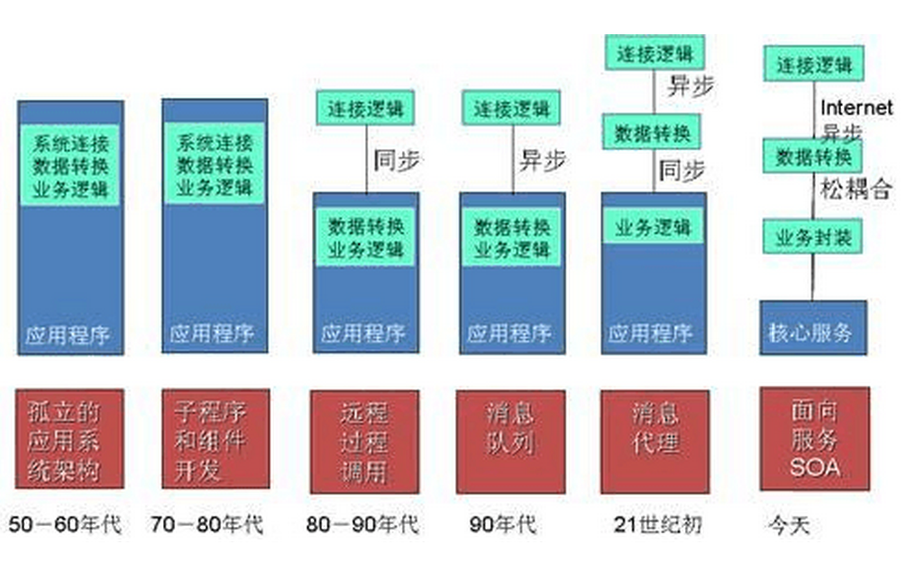
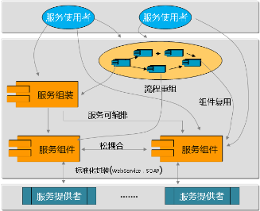

# 中间件

## 中间件发展的历史

事情从1946年说起，世界上第一台电子计算机埃尼阿克诞生，人类进入信息时代。1955年，约翰巴克斯发明了最早的程序语言Fortran，现代意义上的软件就诞生了。

1964年，IBM发布OS/360操作系统，软件与硬件分离，同时，软件成为一个独立的产业正式登上产业界的舞台。中间件就是软件产业不断发展过程中自然产生的。

90年代，文顿·瑟夫这位互联网之父的发明成为改变IT业的重大革命性创新。互联网促使分布式系统和网络应用的诞生，中间件就是伴随网络技术的产生、发展而兴起的，可以说没有网络就没有现代意义上的中间件。因为，网络环境需要解决异构分布网络环境下软件系统的通信、互操作、协同、事务、安全等共性问题，提高异构分布网络环境下软件系统的互操作性、可移植性、适应性、可靠性等问题。

1968年IBM发布CICS交易事务控制系统，使得应用软件与系统服务分离，这是中间件技术萌芽的标志，因为CICS还不是分布式环境的产物，因此我们往往还不将CICS作为正式的中间件系统。

一般来说，我们将1990年诞生于ATT公司的BELL实验室的Tuxedo系统（后来被NOVELL从ATT公司随着UNIX系统一起买走，后来又卖给了BEA公司，现在归于ORACLE公司旗下了）作为中间件的诞生标志。Tuxedo解决了分布式交易事务控制问题，中间件开始成为网络应用的基础设施，中间件正式成型，这是最早的交易中间件。

1994年IBM发布消息队列服务MQ系列产品，解决分布式系统异步、可靠、传输的通讯服务问题，消息中间件诞生。

1995年，JAVA之父James Gosling发明JAVA语言，JAVA提供了跨平台的通用的网络应用服务，成为今天中间件的核心技术。JAVA是第一个天生的网络应用平台，特别是J2EE发布以来，JAVA从一个编程语言，演变为网络应用架构，成为应用服务平台的事实标准。应用服务器中间件，成为中间件技术的集大成者，也成为事实上的中间件的核心。

2001年，微软发布.NET，中间件演变为.NET和JAVA两大技术阵营。但由于.NET还不是一个完全开放的技术体系，只有一个玩家，因此，虽然.NET也是一种中间件，但由于IBM/ORACLE/SUN/SAP等巨头都无一例外成了JAVA阵营的支持者，因此，我们习惯上提到中间件时，往往不包括.NET中间件体系。

以上谈的是历史，但透过历史事实背后，为什么会出现中间件，这其中的本质因素是什么？

## 中间件发展的驱动力

中间件出现的驱动力主要来自软件研发过程碰到的种种问题。从软件出现最早是用于科学计算，然后是计算机辅助设计、辅助制造等等工业应用。在企业管理领域大规模应用后，业务需求不断的变化、系统不断增加、流程更复杂、系统越来越不堪重负，出现了需求交付方面的重大挑战，以至于人们用软件危机来描述软件工业所面临的困境。

总结起来，软件工业面临的主要问题是四个方面： `质量问题` 、 `效率问题` 、 `互操作问题`、 `灵活应变问题` 。这些问题今天依然困扰着这个行业。

造成这个局面的原因是 __异构性和标准规范的滞后__ 。

### 屏蔽异构性

异构性表现在计算机的软硬件之间的异构性，包括硬件（CPU和指令集、硬件结构、驱动程序等），操作系统（不同操作系统的API和开发环境）、数据库（不同的存储和访问格式）等等。长期以来，高级语言依赖于特定的编译器和操作系统API来编程，而他们是不兼容的，因此软件必须依赖于开发和运行的环境。

造成异构的原因源自市场竞争、技术升级以及保护投资等因素。希望屏蔽异构平台的差异性问题是促成中间件发展的驱动力之一。

### 实现互操作

因为异构性，产生的结果是软件依赖于计算环境，使得各种不同软件之间在不同平台之间不能移植，或者移植非常困难。而且，因为网络协议和通信机制的不同，这些系统之间还不能有效地相互集成。

造成互操作性不好的原因，主要是标准的滞后。解决软件之间的互操作性问题也是促成中间件发展的驱动力之一。

### 共性凝练和复用

软件应用领域越来越多，相同领域的应用系统之间许多基础功能和结构是有相似性的，每次开发系统都从零开始绝对不是一种好的方法，也是对质量和效率的很大的伤害。

尽可能多地凝练共性并复用以提高软件开发效率和质量，通过中间件通过提供简单、一致、集成的开发和运行环境，简化分布式系统的设计、编程和管理，这也是中间件发展的重要驱动力。

在长期的探索过程中，解决软件的四个问题的办法总结起来两个方面：`工程方法`、`平台与技术`。

工程方法就是用工业工程、系统工程的理论、方法和体系来解决软件研发过程中的管理问题，包括团队管理、项目管理、质量控制等等，这就是软件工程。除了软件工程方法之外，我们发明了更多的架构规划、设计和实施的方法，不断累积领域的知识与经验等等。

更好的技术手段，包括更好的程序设计语言、更好的平台和软件开发技术，如面向对象、组件开发、面向服务等等。而这方面，在技术上逐渐发展的成果大部分都凝聚在今天的中间件平台之中。

而这些更好的技术手段，从本质上是通过复用、松耦合、互操作（标准）等机制来提高软件质量、加快软件研发效率、使研发出来的产品能够相互集成并灵活适应变化。

这些因素逐渐促成了中间件软件的形成和发展。

## 中间件的概念

讲了这么多，究竟什么是中间件，也就是 __中间件的定义__ 是什么？

针对这个问题，应该说还没有一个标准的定义，或者说还没有完全取得学术界和产业界的共识。

顾名思义，中间件就是处于中间的软件。但这种不是从功能，或者特性来定义的概念，而是用位置来定义的名字，就容易被不同的人从不同角度赋予其不同的含义。

IDC曾经给中间件下的定义是中间件是一种独立的系统软件或服务程序，分布式应用软件借助这种软件在不同的技术之间共享资源，中间件位于客户机服务器的操作系统之上，管理计算资源和网络通信。

我国学术界一般认可的定义是 `中间件是指网络环境下处于操作系统、数据库等系统软件和应用软件之间的一种起连接作用的分布式软件，主要解决异构网络环境下分布式应用软件的互连与互操作问题，提供标准接口、协议，屏蔽实现细节，提高应用系统易移植性（北京大学梅宏）` 。

中科院软件所研究员仲萃豪形象地把中间件定义为平台＋通信。这个定义限定了只有用于分布式系统中的此类软件才能被称为中间件，同时此定义还可以把中间件与支撑软件和实用软件区分开来。

中间件处于操作系统软件与用户的应用软件的中间。中间件在操作系统、网络和数据库之上，应用软件的下层，总的作用是为处于自己上层的应用软件提供运行与开发的环境，帮助用户灵活、高效地开发和集成复杂的应用软件。形象地说就是上下之间的中间。

此外，中间件主要为网络分布式计算环境提供通信服务、交换服务、语义互操作服务等系统之间的协同集成服务，解决系统之间的互连互通问题。形象地说就是所谓左右之间的中间。

要深入理解什么是中间件，形式化的定义固然重要，我们还得从概念本身去深入理解其核心特征才是最重要的。要理解一个概念，从内涵和外延两个方面去描述是哲学上非常重要的一套方法体系。

### 中间件的特征（内涵）

总结分析，中间件有几个非常重要的特征是必须具备的：

#### 平台化

所谓平台就是能够独立运行并自主存在，为其所支撑的上层系统和应用提供运行所依赖的环境。显然，不是所有的系统或者应用都可以称之为平台的。中间件是一个平台，因此中间件是必须独立存在，是运行时刻的系统软件，它为上层的网络应用系统提供一个运行环境，并通过标准的接口和API来隔离其支撑的系统，实现其独立性，也就是平台性。

因此，目前许多的开发语言、组件库和各种报表设计之类的软件，很难满足平台性，将这类软件叫中间件，是很不合适的。例如，JAVA是一种语言，这种语言的开发工具和开发框架，如Eclipse、JBuilder、Struts，Hibernate等等就不能称为中间件，充其量叫中间件开发工具，而不能叫中间件本身，就如同各种建筑工程设备和机械，如吊臂、搅拌机等不能叫建筑，而只能成为建筑工具一样。而J2EE应用服务器提供JAVA应用的运行环境，就是经典的中间件。

#### 应用支撑

中间件的最终目的是解决上层应用系统的问题，而且也是软件技术发展到今天对应用软件提供最完善彻底的解决方案。

高级程序设计语言的发明，使得软件开发变成一个独立的科学和技术体系，而操作系统平台的出现，使得应用软件通过标准的API接口，实现了软件与硬件的分离。

现代面向服务的中间件在软件的模型、结构、互操作以及开发方法等四个方面提供了更强的应用支撑能力：

模型：构件模型弹性粒度化，即通过抽象层度更高的构件模型，实现具备更高结构独立性、内容自包含性和业务完整性的可复用构件，即服务。并且在细粒度服务基础上，提供了更粗粒度的服务封装方式，即业务层面的封装，形成业务组件，就可以实现从组件模型到业务模型的全生命周期企业建模的能力。

结构：结构松散化，即，将完整分离服务描述和服务功能实现以及服务的使用者和提供者，从而避免分布式应用系统构建和集成时常见的技术、组织、时间等不良约束。

互操作：交互过程标准化，即，将与互操作相关的内容进行标准化定义，如服务封装、描述、发布、发现、调用等契约，通信协议以及数据交换格式等等。最终实现访问互操作、连接互操作和语义互操作。

开发集成方法：应用系统的构建方式由代码编写转为主要通过服务间的快捷组合及编排，完成更为复杂的业务逻辑的按需提供和改善，从而大大简化和加速应用系统的搭建及重构过程。

而要最终解决软件的 `质量问题` 、 `效率问题` 、 `互操作问题` 、 `灵活应变问题` 这四大问题，需要在软件技术的 `内在结构(Structure)` 、 `架构(Architecture)` 层面进行思考。

解决这些问题，技术的本质是 `复用` 、 `松耦合` 、 `互操作(标准)` 等软件技术的内在机制。这也是中间件技术和产品的本质特征。

#### 软件复用

软件复用，即软件的重用，也叫再用，是指同一事物不作修改或稍加改动就多次重复使用。从软件复用技术的发展来看，就是不断提升抽象级别，扩大复用范围。最早的复用技术是子程序，人们发明子程序，就可以在不同系统之间进行复用了。但是，子程序是最原始的复用，因为这种复用范围是一个可执行程序内复用，静态开发期复用，如果子程序修改，意味着所有调用这个子程序的程序必须重新编译、测试和发布。

__复用对象复用范围__

| 复用对象 | 复用范围 |
| :--: | :-- |
| 子程序 | 一个可执行程序内复用，静态开发期 复用 |
| 组件(DLL,Com等) | 系统内复用，动态运行期复用 |
| 企业对象组件（Com+,.NET,EJB等) | 企业网络内复用，不同系统之间复用 |
| 服务 (如WebService,SCA/SDO) | 不同企业之间，全球复用，动态可配置 |

为了解决这个问题，发明了组件（或者叫控件），如MS操作系统下的DLL组件。组件将复用提升了一个层次，因为组件可以在一个系统内复用（同一种操作系统），而且是动态、运行期复用。这样组件可以单独发展，组件与组件调用者之间的耦合度降低。

为解决分布式网络计算之间的组件复用，人们发明了企业对象组件，如（COM+, .NET, EJB等)，或者叫分布式组件。通过远程对象代理，来实现企业网络内复用，不同系统之间复用。

传统中间件的核心是组件对象的管理。但分布式组件也是严重依赖其受控环境，由于构件实现和运行支撑技术之间存在着较大的异构性，不同技术设计和实现的构件之间无法直接组装式复用。

而现代中间件的发展重要趋势就是以服务为核心，如WebService, SCA/SDO等。通过服务，或者服务组件来实现更高层次的复用、解耦和互操作，即SOA架构中间件。

因为服务是通过标准封装，服务组件之间的组装、编排和重组，来实现服务的复用。而且这种复用，可以在不同企业之间，全球复用，达到复用的最高级别，并且是动态可配置的复用。

#### 耦合关系

基于SOA架构的中间件，在松耦合解耦过程也发展到了最后的境界。传统软件将软件之中核心三部分——网络连接、数据转换、业务逻辑全部耦合在一个整体之中，形成铁板一块的软件，牵一发而动全身，软件就难以适应变化。分布式对象技术将“连接逻辑”进行分离，消息中间件将“连接逻辑”进行异步处理，增加了更大的灵活性。消息代理和一些分布式对象中间件将数据转换也进行了分离。而SOA架构，通过服务的封装，实现了业务逻辑与网络连接、数据转换等进行完全的解耦。

#### 互操作性

传统软件互操作技术也存在问题。互联网前所未有的开放性意味着各节点可采用不同的中间件技术，对技术细节进行了私有化的约束，构件模型和架构没有统一标准，从而导致中间件平台自身在构件描述、发布、发现、调用、互操作协议及数据传输等方面呈现出巨大的异构性。各种不良技术约束的结果是软件系统跨互联网进行交互变得困难重重，最终导致了跨企业/部门的业务集成和重组难以灵活快速的进行。

在软件的互操作方面，传统中间件只是实现了访问互操作，即通过标准化的API实现了同类系统之间的调用互操作，而连接互操作还是依赖于特定的访问协议，如JAVA使用RMI，CORBA使用IIOP等。而SOA通过标准的、支持Internet、与操作系统无关的SOAP协议实现了连接互操作。而且，服务的封装是采用XML协议，具有自解析和自定义的特性，这样，基于SOA的中间件还可以实现语义互操作。

总之，服务化体现的是中间件在完整业务复用、灵活业务组织方面的发展趋势，其核心目标是提升IT基础设施的业务敏捷性。因此，中间件将成为SOA的主要实现平台。

### 中间件的分类（外延）

中间件所包括的范围十分广泛，针对不同的应用需求涌现出多种各具特色的中间件产品。从功能性外延来看，中间件包括交易中间件、消息中间件、集成中间件等各种功能性的中间件技术和产品。

现在，中间件已经成为网络应用系统开发、集成、部署、运行和管理必不可少的工具。由于中间件技术涉及网络应用的各个层面，涵盖从基础通讯、数据访问到应用集成等众多的环节，因此，中间件技术呈现出多样化的发展特点。

根据中间件在软件支撑和架构的定位来看，基本上可以分为三大类产品：`应用服务类中间件`、`应用集成类中间件`、`业务架构类中间件`。

#### 应用服务类中间件

为应用系统提供一个综合的计算环境和支撑平台，包括对象请求代理（ORB）中间件、事务监控交易中间件、JAVA应用服务器中间件等。

随着对象技术与分布式计算技术的发展，两者相互结合形成了分布对象计算，并发展为当今软件技术的主流方向。1990年底，对象管理组织OMG首次推出对象管理结构OMA(Object Management Architecture)，对象请求代理（Object Request Broker）是这个模型的核心组件。它的作用在于提供一个通信框架，透明地在异构的分布计算环境中传递对象请求。CORBA规范包括了ORB的所有标准接口，是对象请求代理的典型代表。

随着分布计算技术的发展，分布应用系统对大规模的事务处理提出了需求，比如商业活动中大量的关键事务处理。事务处理监控界于Client和Server之间，进行事务管理与协调、负载平衡、失败恢复等，以提高系统的整体性能。它可以被看作是事务处理应用程序的操作系统。这类被称为交易中间件，适用于联机交易处理系统，主要功能是管理分布于不同计算机上的数据的一致性，保障系统处理能力的效率与均衡负载。交易中间件所遵循的主要标准是X/open DTP模型，典型的产品是Tuxedo。

JAVA从2.0企业版之后，不仅仅是一种编程语言，而且演变为一个完整的计算环境和企业架构。为JAVA应用提供组件容器，用来构造Internet应用和其它分布式构件应用，是企业实施电子商务的基础设施，这种应用服务器中间件发展到为企业应用提供数据访问、部署、远程对象调用、消息通信、安全服务、监控服务、集群服务等强化应用支撑的服务。使得JAVA应用服务器成为了事实上的应用服务器工业标准。由于它的开放性，使得交易中间件和对象请求代理逐渐融合到应用服务器之中。典型的应用服务器产品包括IBM Websphere Application Server、Oracle Weblogic Application Server和金蝶Apusic Application Server等。

#### 应用集成类中间件

应用集成类中间件是提供各种不同网络应用系统之间的消息通信、服务集成和数据集成的功能，包括常见的消息中间件、企业集成EAI、企业服务总线以及相配套的适配器等。

消息中间件指的是利用高效可靠的消息传递机制进行平台无关的数据交流，并基于数据通信来进行分布式系统的集成。通过提供消息传递和消息排队模型，它可在分布环境下扩展进程间的通信，并支持多通讯协议、语言、应用程序、硬件和软件平台，实现应用系统之间的可靠异步消息通信，能够保障数据在复杂的网络中高效、稳定、安全、可靠的传输，并确保传输的数据不错、不重、不漏、不丢。目前流行的消息中间件产品有IBM的MQSeries、 BEA的MessageQ、金蝶Apusic MQ等。

企业应用整合，仅指企业内部不同应用系统之间的互连，以期通过应用整合实现数据在多个系统之间的同步和共享。这种类似集线器的架构模式是在基于消息的基础上，引入了前置机-服务器的概念，使用一种集线器/插头（hub-and-spoke）的架构，将消息路由信息的管理和维护从前置机迁移到了服务器上，巧妙的把集成逻辑和业务逻辑分离开来，大大增加了系统弹性。由于前置机和服务器之间不再直接通信，每个前置机只通过消息和服务器之间通信，将复杂的网状结构变成了简单的星型结构。典型的企业应用集成EAI的产品包括Tibico和Informatica等公司产品。

随着SOA思想和技术的逐渐成熟，EAI发展到透过业务服务的概念来提供IT的各项基本应用功能，让这些服务可以自由地被排列组合、融会贯通，以便在未来能随时弹性配合新的需求而调整。Web Services是SOA的一种具体实现方式，SOA的世界是由服务提供者（Service Provider）、服务请求者（Service Requester） 以及服务代理者（Service Broker）所组成，目标是将所有具备价值的IT资源，不论是旧的或新的，通通都能够透过Web Services的包装，成为随取即用的IT资产，并可将各种服务快速汇整，开发出组合式应用，达到整合即开发的目的。SOA的架构只是实现和解决了服务模块间调用的互操作问题，为了更好的服务于企业应用，引入了企业服务总线的应用架构（Enterprise Service Bus，ESB）。这一构架是基于消息通信、智能路由、数据转换等技术实现的。ESB提供了一个基于标准的松散应用耦合模式，这就是企业服务总线中间件，是一种综合的企业集成中间件。典型的ESB产品包括IBM Websphere ESB、Oracle公司的Weblogic ESB以及金蝶Apusic ESB等。

#### 业务架构类中间件

作为共性的凝练，中间件不仅要从底层的技术入手，将共性技术的特征抽象进中间层，还要更多地把目光投向到业务层面上来，根据业务的需要，驱动自身能力的不断演进，即，不断出现的新的业务需要驱动了应用模式和信息系统能力的不断演进，进而要求中间件不断地凝练更多的业务共性，提供针对性支撑机制。近年来，这一需求趋势愈发明显，越来越多的业务和应用模式被不断地抽象进入中间件的层次，如业务流程流、业务模型、业务规则、交互应用等等，其结果是中间件凝练的共性功能越来越多，中间件的业务化和领域化的趋势非常明显。

业务架构类中间件包括业务流程、业务管理和业务交互等几个业务领域的中间件。

业务流程是处理业务模型的非常重要方法。管理流程与各职能部门和业务单元有密切关系，须藉各部门间的紧密协调，以达到企业运营和管理功能的目标。在业务流程支持方面，从早期的WfMC定义的工作流，到基于服务的业务流程规范BPEL，由业务流程的支撑，逐渐形成了完整的业务流程架构模型，包括流程建模、流程引擎、流程执行、流程监控和流程分析等。有名的业务流程中间件包括基于工作流的IBM Lotus Workflow，基于BPEL的IBM Webshpere Process Server以及同时支持工作流和BPEL的金蝶Apusic BPM等。

业务管理就是对业务对象的建模和业务规则的定义、运行和监控的中间件平台。策略管理员和开发人员将业务逻辑捕获为业务规则。使用规则管理器可以将规则轻松地嵌入 Web、现有应用程序和后台办公应用程序。常见的业务管理中间件包括IBM Websphere ILOG 业务规则管理系统，金蝶BOS等。

业务交互的中间件平台提供组织的合作伙伴、员工和客户通过WEB和移动设备等交互工具，实现基于角色、上下文、操作、位置、偏好和团队协作需求的个性化的用户体验。这种门户服务器软件基于标准Portlet组合的应用程序访问框架，实现用户集成和交互集成，构建灵活、基于 SOA 的应用架构。典型的门户中间件有IBM Websphere Portal Server和金蝶Apusic Portal Server等。

### 中间件的未来

中间件是互联网时代的IT基础设施，提供业务的灵活性，消除信息孤岛，提高IT的研发和运营效率。作为网络计算的核心基础设施，中间件正在呈现出服务化、自治化、业务化、一体化等诸多新的发展趋势，中间件进入2.0时代，将极大提升互联网统一计算平台的敏、睿、融、和能力。

#### 中间件将变宽变厚

以互联网为核心的多网融合产生了丰富多样的新型网络应用模式，作为主流的应用运行支撑环境，中间件无处不在，越来越多的应用模式被抽象到中间件层，中间件将变宽变厚。

#### 中间件将面向服务、易于集成

随着SOA技术逐渐成为主流，以及异构系统的集成问题日益严峻，中间件将向面向服务、易于集成的方向发展。

#### 中间件将向一体化的方向发展

中间件产品的种类日趋多样（如交易中间件、消息中间件、应用服务器、集成中间件、业务中间件等），但其技术架构将向一体化的方向发展，主要包括：

统一内核，易于演化：各大厂商的中间件产品将构建在统一内核之上，使其易于平台演化。

统一编程模型，易于开发：不同中间件产品提供了不同的编程模型，这些编程模型将趋向统一，从而达到易于开发的目的。

统一管理模型，易于系统维护：不同中间件产品提供了不同的管理工具与管理手段，这些管理工具与手段将趋向统一，使其易于管理，降低运维成本。

#### 中间件产品将支持云计算，易于交付

中间件产品将成为云计算的支撑平台，使应用易于交付。

#### 后端平台深度融合

一个大胆的设想是：未来五年，浏览器将统一前端，而后端平台（中间件、操作系统、 数据库）走向深度融合。（对中间件的未来发展趋势的详细介绍参加另文《中间件技术的发展趋势分析》，在此不做详细论述。）

综上所述，我们可以认为中间件是一种独立的系统软件平台，为网络应用软件提供综合的服务和完整的计算环境，借助这种软件使得网络应用能够实现集成，达到业务的协同，实现业务的灵活性。

（本文由金蝶中间件有限公司总经理 奉继承 博士 撰写）